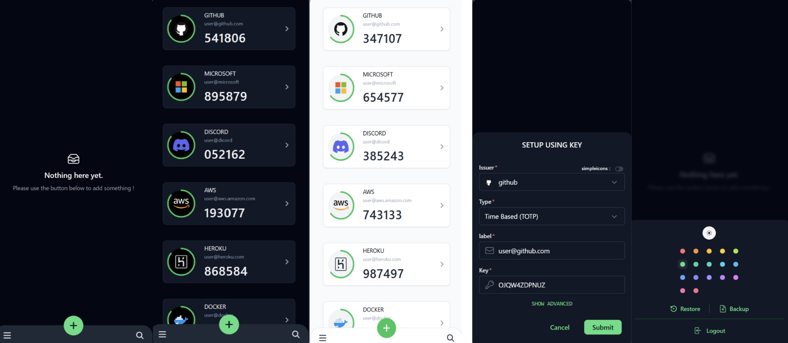

<h1 align="center">MyAuthenticator</h1>

<p align="center">A serverless web application that generates TOTP and HOTP codes, enabling robust two-factor authentication (2FA) directly within your browser.
</p>
<div align="center">
	
[](https://nuxt.com)
[](https://pages.cloudflare.com)
[](https://www.typescriptlang.org)
[](https://drizzle.com)
[](https://tailwindcss.com)

</div>

## Live Demo

See the live demo:

[](https://my-authenticator.pages.dev)

- Credentials: `admin` - `Admin@123$`

## Features 🔥

🚀 **Serverless:** Leverages complete edge support, eliminating the need to maintain a server. You can deploy this project on your Cloudflare account for _free_.

⚙️ **Compatibility:** MyAuthenticator supports TOTP (Time-Based One-Time Password) and HOTP (HMAC-Based One-Time Password), which are widely used by most services for two-factor authentication.

☀️ **Theming:** Offers light and dark themes, with customizable accent colors.

💫 **Icons:** Includes 100+ colored icons and access to 3000+ icons from SimpleIcons, all in SVG format for scalability.

🔐 **Secure:** Uses Nuxt Auth Utils for authentication and encrypts database fields for enhanced security.

🗃️ **Backup / Restore:** Securely backup and restore authenticators with encryption. Supports import from and export to Google Authenticator.

🤖 **Telegram Bot and MiniApp:** You can use this web app as a Telegram miniapp within the Telegram app.

## Screenshots 📱



## Deploy to Cloudflare Pages

> [!NOTE]
> This project is currently under testing and improvements. Please back up your data before proceeding.

### Environment Variables

```sh
# required
NUXT_SESSION_PASSWORD="your-super-long-secret-for-session-encryption"
NUXT_AUTH_USERNAME="admin"
NUXT_AUTH_PASSWORD="Admin@123$"

# optional
NUXT_DB_ENCRYPTION_PASSWORD="your-super-long-secret-for-db-encryption"
NUXT_TELEGRAM_BOT_TOKEN="12345678:AAEzFGO9ME4i7hV9gfPTgAcJABCDEFG"
NUXT_TELEGRAM_USERID="874962691"
```

### Required Variables

- `NUXT_SESSION_PASSWORD`: This password is used by `nuxt-auth-utils` to secure your session. It must be at least 32 characters long.

- `NUXT_AUTH_USERNAME`: The username for authentication. It must be at least 5 characters long.

- `NUXT_AUTH_PASSWORD`: The password for authentication. It must be at least 8 characters long and include:
  - One uppercase letter
  - One digit
  - One lowercase letter
  - Two special characters

### Optional Variables

- `NUXT_DB_ENCRYPTION_PASSWORD`: This password is used to encrypt and decrypt the database field of `secretkey`. By default, no encryption is used for data stored in the database. You can enable encryption by setting this variable. It must be exactly 32 characters long.

- `NUXT_TELEGRAM_BOT_TOKEN`: This is the Bot Token for the Telegram Bot, which can be obtained from [@BotFather](https://telegram.dog/BotFather). Required for using this web app as a Telegram miniapp.

- `NUXT_TELEGRAM_USERID`: This is your Telegram User ID used to identify you as a user of the bot. Obtain it from [@MissRose_bot](https://telegram.dog/MissRose_bot) using the `/info` command. Required for using this web app as a Telegram miniapp.

### Using NuxtHub

You can deploy this project on your Cloudflare account for free and with zero configuration using [NuxtHub](https://hub.nuxt.com)

- First, fork this repository.

- Follow this [guide](https://hub.nuxt.com/docs/getting-started/deploy) and add the necessary environment variables.

- After deploying, go to your project and create a table in the database by running the following SQL query in the `SQL runner`:

```sql
CREATE TABLE `accounts` (
	`id` integer PRIMARY KEY AUTOINCREMENT NOT NULL,
	`type` text NOT NULL,
	`issuer` text NOT NULL,
	`label` text NOT NULL,
	`secret` text NOT NULL,
	`algorithm` text NOT NULL,
	`digits` integer NOT NULL,
	`period` integer NOT NULL,
	`counter` integer NOT NULL,
	`icon` text NOT NULL,
	`icontype` text NOT NULL,
	`createdAt` text DEFAULT (current_timestamp) NOT NULL
);
```

- Alternatively, you can deploy using:

```bash
npx nuxthub deploy
```

- Once you deployed your project, apply migrations in production with:

```bash
npx nuxi dev --remote
```

- That's it, you've created your own authenticator.

- You can set up your Telegram bot at https://< yourapp >.pages.dev/telegram

## Contributing and Suggestions

Feel free to contribute to this project with your ideas and improvements. Your feedback and suggestions are highly valued and will help enhance this project further.

## Copyright

Copyright (C) 2024 [IAMSDR](https://github.com/iamsdr) under [GNU Affero General Public License](https://www.gnu.org/licenses/agpl-3.0.en.html).

MyAuthenticator is Free Software: You can use, study share and improve it at your
will. Specifically you can redistribute and/or modify it under the terms of the
[GNU Affero General Public License](https://www.gnu.org/licenses/agpl-3.0.en.html) as
published by the Free Software Foundation, either version 3 of the License, or
(at your option) any later version. Also keep in mind that all the forks of this repository MUST BE OPEN-SOURCE and MUST BE UNDER THE SAME LICENSE.
